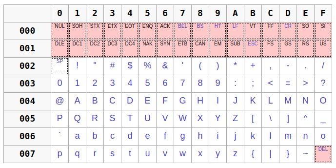

# Cours c++ du 2 novembre - groupe 9

rappels de cours très rapides  
pour le vrai cours lire `cpp.bmarchand.fr`

## I. Les fonctions

### I.1 Définition et surcharge

```c++
void incr (int* pi) {
    *pi = (*pi) + 1;
}
int incr (int i) {
    return i+1;
}
int main () {
    int i = 12;
    incr(&i);
    int j = incr(i);
    return 0;
}
```

- on surcharge les fonctions sur le nombre et le type des arguments  
  (pas sur le type de retour)

----------

### I.2 Passage des arguments

- Quels sont les nombres affichés ? Et pourquoi ?


```c++
#include <iostream>
#include <vector>

void ajouter_99 (std::vector<int> v) {
    v.push_back(99);
}

int main () {
    std::vector<int> tab{1, 2, 3, 4, 5};
    ajouter_99(tab);
    for (auto e : tab)
        std::cout << e << " ";

    // Quels sont les nombres affichés ?
```

Lorsque `c++` exécute l'expression `ajouter_99(tab);`, `99` n'est pas ajouté dans `tab`.

Le passage des arguments en `c++` se fait par copie donc `v` est une copie de `tab` et non une référence vers `tab`.
(notons aussi que la manière de copier un objet de type `std::vector` est décidée par la classe `std::vector` qui recopie les éléments du vector copié dans la copie)

La **référence** `&` vous permet de passer un argument de manière à ce qu'il réfère à un objet existant.
```c++
void ajouter_vraiment_99 (std::vector<int>& v) {
    v.push_back(99);
}
```

Si on appelle la fonction `ajouter_vraiment_99(tab);`, à la place de `ajouter_99(tab);`, `v` est une référence vers l'objet `tab` donc si vous mofifiez `v` vous modifiez `tab`.


----------

## II Les chaînes de caractères

### II.1 Le type `char`

- on veut afficher la taille maximum du type `char`  
on utilise la librairie `limits`.

```c++
  char max = std::numeric_limits<char>::max();
  // on les affiche ...
  std::cout << "max char: " << max << std::endl;
  // l'affichage vous convient ?
```

- le caractère max du type `char` sur mon portable est `+127`
- considéré comme un `char` à l'affichage, ce n'est pas son code qui s'affiche mais le `char` que le code `ascii` représente

- $\Rightarrow$ si vous voulez afficher son code, considérez le comme un `int`  
en les convertissant explicitement:
  
```c++
  std::cout << static_cast<int>(max) // 127
            << std::endl;
```

----------


- voici les 128 caractères `ascii`  de `'0'` à `'127'` (qui ***tiennent*** sur un `signed char`)



**copyright wikipedia**

----------

### II.2 Le type `std::string`

- faire les différents `for`
- tester le premier caractère d'une `std::string` 
- passer par référence

----------


## IV. Les instructions
(apprentissage par l'usage...)

### `if`/`else`

### `while`/`do-while`

### `for`/`for-auto`

### `break`/`continue`

### `switch` (`break`)

----------

## TP la calculette en notation polonaise inversée

`((1 + 2) × 4) + 3`  est
- `1 2 + 4 × 3 +`
- ou `3 4 1 2 + × +`

----------